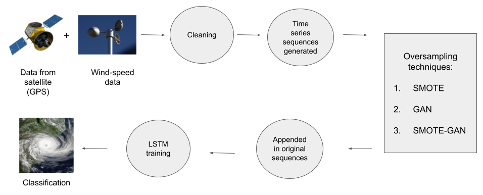

# Data augmentation-based deep learning framework for cyclone rapid intensification prediction
Amandeep Singh and Rohitash Chandra Senior Member, IEEE  
(Under review)

- In this paper, we use novel deep learning methods for detecting and forecasting tropical cyclone rapid intensification in wind-intensity.
- We note that rapid intensification in wind-intensity is a class imbalance problem.
- To address this, we use data augmentation techniques; generative adversarial networks (GANs), synthetic minority over-sampling technique (SMOTE) and SMOTE-GAN framework to generate data for minority classes

  

